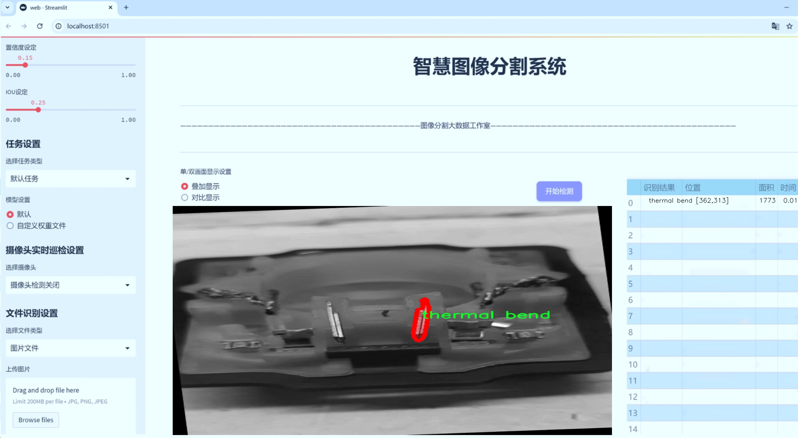
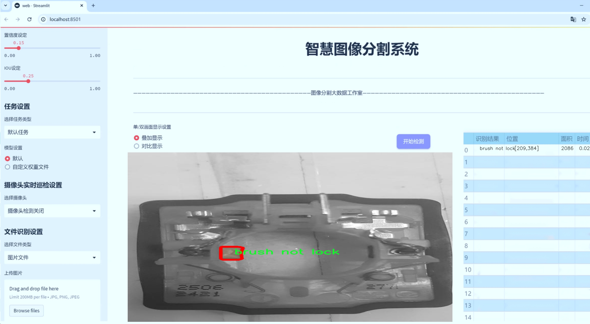
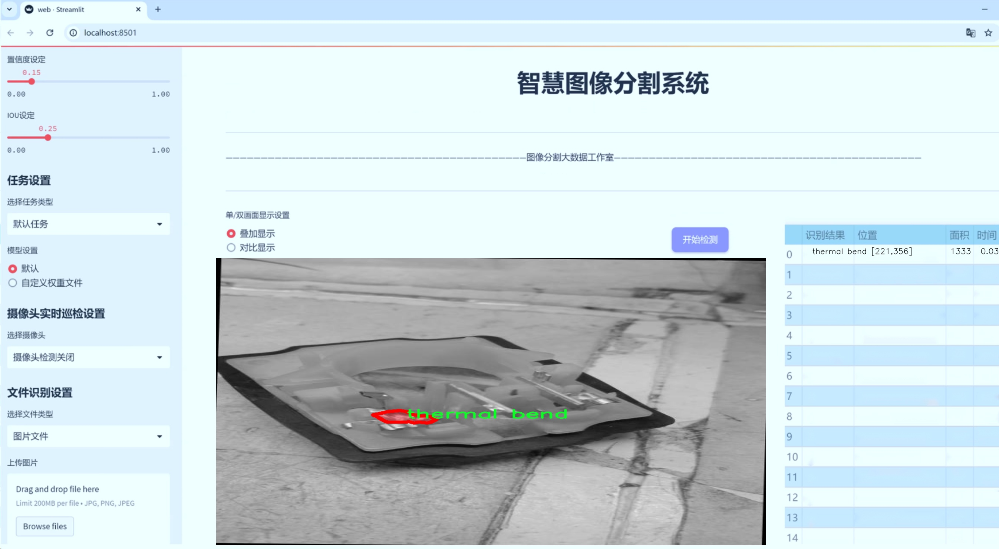
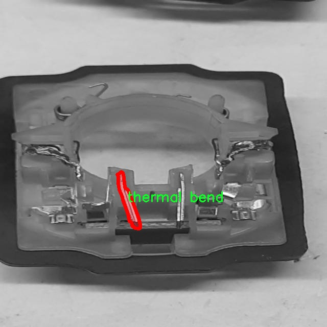
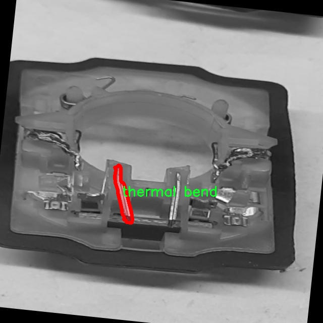
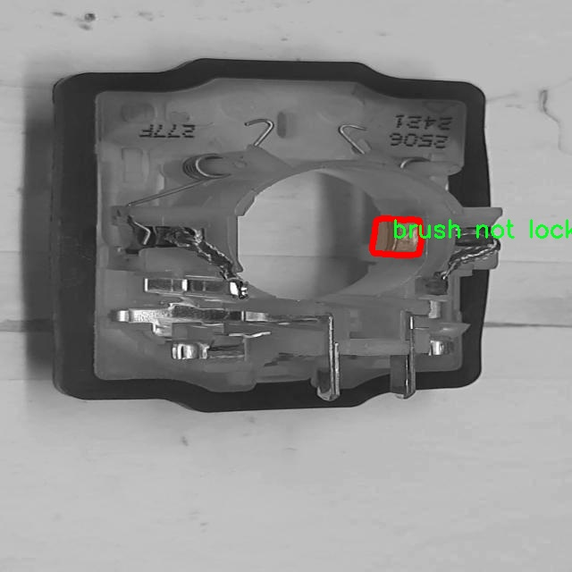

# 工业缺陷图像分割系统源码＆数据集分享
 [yolov8-seg-vanillanet＆yolov8-seg-dyhead-DCNV3等50+全套改进创新点发刊_一键训练教程_Web前端展示]

### 1.研究背景与意义

项目参考[ILSVRC ImageNet Large Scale Visual Recognition Challenge](https://gitee.com/YOLOv8_YOLOv11_Segmentation_Studio/projects)

项目来源[AAAI Global Al lnnovation Contest](https://kdocs.cn/l/cszuIiCKVNis)

研究背景与意义

随着工业自动化和智能制造的快速发展，工业生产过程中对产品质量的要求日益提高。传统的人工检测方法不仅效率低下，而且容易受到人为因素的影响，导致检测结果的不稳定性和不准确性。因此，如何利用先进的计算机视觉技术提高工业缺陷检测的效率和准确性，成为了当前工业界和学术界亟待解决的重要课题。在此背景下，基于深度学习的图像分割技术逐渐崭露头角，尤其是YOLO（You Only Look Once）系列模型因其高效的实时检测能力而受到广泛关注。

YOLOv8作为YOLO系列的最新版本，结合了更为先进的网络结构和优化算法，具备了更强的特征提取能力和更快的推理速度。针对工业缺陷图像的分割任务，YOLOv8的实例分割能力使其能够在复杂背景下精确识别和分割出不同类型的缺陷区域。这对于提高工业产品的质量控制水平、降低生产成本具有重要的现实意义。通过对缺陷图像的自动化处理，企业可以在生产过程中及时发现问题，采取相应的措施，从而减少不合格产品的流出，提升整体生产效率。

本研究旨在基于改进的YOLOv8模型，构建一个高效的工业缺陷图像分割系统。该系统将应用于特定的工业缺陷检测任务，涉及到五类缺陷：刷损、刷锁未锁、印刷问题、热弯和焊接偏移。通过对1300幅图像的深度学习训练，系统将能够在实际应用中实现对这些缺陷的高精度识别与分割。数据集的多样性和丰富性为模型的训练提供了良好的基础，使得模型能够适应不同的工业场景和复杂的背景条件。

在研究过程中，我们将针对YOLOv8模型进行多方面的改进，以提升其在工业缺陷图像分割任务中的表现。这包括对网络结构的优化、损失函数的调整以及数据增强技术的应用等。通过这些改进，期望能够提高模型的准确率和鲁棒性，使其在实际应用中能够更好地应对各种挑战。

本研究的意义不仅在于推动工业缺陷检测技术的发展，更在于为智能制造的实施提供切实可行的解决方案。通过将深度学习技术与工业检测相结合，我们希望能够为企业带来更高的生产效率和更低的质量风险，助力工业4.0时代的到来。此外，研究成果还将为相关领域的研究提供借鉴，推动计算机视觉技术在其他工业应用中的发展，具有广泛的应用前景和深远的社会价值。

### 2.图片演示







##### 注意：由于此博客编辑较早，上面“2.图片演示”和“3.视频演示”展示的系统图片或者视频可能为老版本，新版本在老版本的基础上升级如下：（实际效果以升级的新版本为准）

  （1）适配了YOLOV8的“目标检测”模型和“实例分割”模型，通过加载相应的权重（.pt）文件即可自适应加载模型。

  （2）支持“图片识别”、“视频识别”、“摄像头实时识别”三种识别模式。

  （3）支持“图片识别”、“视频识别”、“摄像头实时识别”三种识别结果保存导出，解决手动导出（容易卡顿出现爆内存）存在的问题，识别完自动保存结果并导出到tempDir中。

  （4）支持Web前端系统中的标题、背景图等自定义修改，后面提供修改教程。

  另外本项目提供训练的数据集和训练教程,暂不提供权重文件（best.pt）,需要您按照教程进行训练后实现图片演示和Web前端界面演示的效果。

### 3.视频演示

[3.1 视频演示](https://www.bilibili.com/video/BV1THy8YjEkH/)

### 4.数据集信息展示

##### 4.1 本项目数据集详细数据（类别数＆类别名）

nc: 5
names: ['brush damage', 'brush not lock', 'printing prblm', 'thermal bend', 'welding offset']


##### 4.2 本项目数据集信息介绍

数据集信息展示

在现代工业生产中，产品质量的保证是企业竞争力的重要组成部分。随着自动化和智能化技术的不断发展，图像处理技术在工业缺陷检测中的应用愈发广泛。为此，我们构建了一个名为“cbx_from_scratch”的数据集，旨在为改进YOLOv8-seg的工业缺陷图像分割系统提供高质量的训练数据。该数据集专注于五种常见的工业缺陷，涵盖了从生产到最终检验过程中可能出现的多种问题，具有重要的实际应用价值。

“cbx_from_scratch”数据集包含五个类别，分别是“刷损伤（brush damage）”、“刷未锁定（brush not lock）”、“印刷问题（printing prblm）”、“热弯曲（thermal bend）”和“焊接偏移（welding offset）”。这些类别的选择基于对工业生产过程中常见缺陷的深入分析，旨在帮助企业更好地识别和处理这些问题，从而提高产品的整体质量和生产效率。

在数据集的构建过程中，我们采集了大量的工业图像，涵盖了不同的生产环境和工艺条件。每个类别的图像均经过精心标注，确保其准确性和可靠性。例如，在“刷损伤”类别中，我们收集了多种不同角度和光照条件下的刷子损伤图像，力求全面反映该缺陷的特征。而在“焊接偏移”类别中，则包括了不同焊接工艺下的焊接质量问题图像，以便于模型能够学习到多样化的缺陷表现。

为了确保数据集的多样性和代表性，我们在不同的生产线和设备上进行了图像采集。这种多样化的采集方式使得数据集不仅包含了理想状态下的图像，还涵盖了在实际生产中可能遇到的各种复杂情况。这种设计理念旨在提升模型的泛化能力，使其能够在真实场景中更有效地进行缺陷检测和分割。

在数据预处理阶段，我们对图像进行了标准化处理，包括尺寸调整、颜色空间转换等，以适应YOLOv8-seg模型的输入要求。此外，为了增强模型的鲁棒性，我们还应用了数据增强技术，如随机裁剪、旋转和翻转等。这些处理措施不仅提高了数据集的有效性，也为模型训练提供了更多的样本变体，帮助模型更好地学习到各类缺陷的特征。

通过对“cbx_from_scratch”数据集的深入分析与应用，我们期望能够显著提升YOLOv8-seg在工业缺陷图像分割任务中的表现。该数据集的构建不仅为研究人员提供了一个高质量的训练基础，也为工业界在缺陷检测和质量控制方面提供了有力的支持。未来，我们将继续优化数据集，增加更多的缺陷类别和样本，以进一步推动工业图像处理技术的发展。








### 5.全套项目环境部署视频教程（零基础手把手教学）

[5.1 环境部署教程链接（零基础手把手教学）](https://www.bilibili.com/video/BV1jG4Ve4E9t/?vd_source=bc9aec86d164b67a7004b996143742dc)


[5.2 安装Python虚拟环境创建和依赖库安装视频教程链接（零基础手把手教学）](https://www.bilibili.com/video/BV1nA4VeYEze/?vd_source=bc9aec86d164b67a7004b996143742dc)

### 6.手把手YOLOV8-seg训练视频教程（零基础小白有手就能学会）

[6.1 手把手YOLOV8-seg训练视频教程（零基础小白有手就能学会）](https://www.bilibili.com/video/BV1cA4VeYETe/?vd_source=bc9aec86d164b67a7004b996143742dc)


按照上面的训练视频教程链接加载项目提供的数据集，运行train.py即可开始训练



     Epoch   gpu_mem       box       obj       cls    labels  img_size
     1/200     0G   0.01576   0.01955  0.007536        22      1280: 100%|██████████| 849/849 [14:42<00:00,  1.04s/it]
               Class     Images     Labels          P          R     mAP@.5 mAP@.5:.95: 100%|██████████| 213/213 [01:14<00:00,  2.87it/s]
                 all       3395      17314      0.994      0.957      0.0957      0.0843

     Epoch   gpu_mem       box       obj       cls    labels  img_size
     2/200     0G   0.01578   0.01923  0.007006        22      1280: 100%|██████████| 849/849 [14:44<00:00,  1.04s/it]
               Class     Images     Labels          P          R     mAP@.5 mAP@.5:.95: 100%|██████████| 213/213 [01:12<00:00,  2.95it/s]
                 all       3395      17314      0.996      0.956      0.0957      0.0845

     Epoch   gpu_mem       box       obj       cls    labels  img_size
     3/200     0G   0.01561    0.0191  0.006895        27      1280: 100%|██████████| 849/849 [10:56<00:00,  1.29it/s]
               Class     Images     Labels          P          R     mAP@.5 mAP@.5:.95: 100%|███████   | 187/213 [00:52<00:00,  4.04it/s]
                 all       3395      17314      0.996      0.957      0.0957      0.0845


### 7.50+种全套YOLOV8-seg创新点代码加载调参视频教程（一键加载写好的改进模型的配置文件）

[7.1 50+种全套YOLOV8-seg创新点代码加载调参视频教程（一键加载写好的改进模型的配置文件）](https://www.bilibili.com/video/BV1Hw4VePEXv/?vd_source=bc9aec86d164b67a7004b996143742dc)

### 8.YOLOV8-seg图像分割算法原理

原始YOLOV8-seg算法原理

YOLOv8-seg是2023年由Ultralytics公司推出的YOLO系列算法中的一个重要分支，专注于目标检测与分割任务的结合。作为YOLO系列的最新版本，YOLOv8-seg不仅继承了前几代模型的优点，还引入了一系列创新性的设计理念和技术改进，以提高模型的性能和适用性。YOLOv8-seg在架构上与YOLOv8n保持一致，但在特征提取和处理上进行了特别的调整，以适应分割任务的需求。

首先，YOLOv8-seg的主干网络采用了CSP（Cross Stage Partial）结构，进一步优化了特征提取的效率。CSP结构通过将特征提取过程分为两个部分，分别进行卷积和连接，有效地减少了计算量，同时保持了模型的表达能力。YOLOv8-seg在此基础上，使用了C2f模块替代了YOLOv5中的C3模块。C2f模块引入了更多的跳层连接，增强了梯度流动，提升了模型的训练效率和收敛速度。此外，C2f模块的设计还考虑到了轻量化的需求，使得YOLOv8-seg在保持高性能的同时，能够在资源受限的环境中运行。

在特征融合层，YOLOv8-seg采用了PAN-FPN（Path Aggregation Network - Feature Pyramid Network）结构，以实现多尺度特征的有效融合。PAN-FPN通过对不同层次的特征进行聚合，增强了模型对不同尺度目标的检测能力。这一结构的设计使得YOLOv8-seg能够更好地处理复杂场景中的目标分割任务，尤其是在目标尺寸变化较大的情况下，能够保持较高的分割精度。

YOLOv8-seg的检测网络则采用了Anchor-Free的检测方式，简化了传统目标检测中对锚框的依赖。通过解耦头结构，YOLOv8-seg将分类和定位任务分开处理，分别使用两条并行的分支来提取类别和位置特征。这种设计不仅提高了模型的收敛速度，还提升了预测的精度。分类任务更加关注特征图中与已知类别的相似性，而定位任务则更关注边界框与真实框之间的关系。通过这种方式，YOLOv8-seg能够在分类和定位上实现更好的平衡，进而提高整体的检测性能。

为了进一步优化模型的学习过程，YOLOv8-seg引入了任务对齐学习（Task Alignment Learning，TAL）机制。这一机制通过引入分类分数和IOU（Intersection over Union）的高次幂乘积，作为衡量任务对齐程度的指标，使得模型在分类和定位损失函数中都能充分考虑到这项指标。这种创新的损失函数设计，使得YOLOv8-seg在训练过程中能够更好地平衡分类和定位的需求，从而提高模型的整体性能。

在数据增强方面，YOLOv8-seg在训练过程中采用了Mosaic数据增强技术，以提升模型的鲁棒性和泛化能力。然而，考虑到Mosaic数据增强可能会对数据的真实分布造成一定影响，YOLOv8-seg在训练的最后10个epoch中停止使用这一技术，以确保模型在真实场景中的表现更加可靠。

YOLOv8-seg在模型的推理速度和精度上也取得了显著的进展。通过对模型结构的优化，YOLOv8-seg在同等条件下的推理速度相比于前几代YOLO模型有了明显的提升，而在精度上也保持了较高的水平。这使得YOLOv8-seg在实时目标检测与分割任务中表现出色，尤其适用于需要快速响应的应用场景，如自动驾驶、安防监控和机器人视觉等。

总的来说，YOLOv8-seg通过一系列创新的设计和优化，不仅提升了目标检测的准确性和速度，还有效地结合了目标分割的需求，成为一个功能强大且灵活的视觉处理工具。其在特征提取、特征融合、检测策略和损失函数等方面的改进，使得YOLOv8-seg在实际应用中展现出广泛的适用性和优越的性能，具有重要的研究和应用价值。随着YOLOv8-seg的不断发展和完善，未来在更复杂的视觉任务中，它有望发挥更大的作用，推动计算机视觉领域的进一步进步。


### 9.系统功能展示（检测对象为举例，实际内容以本项目数据集为准）

图9.1.系统支持检测结果表格显示

  图9.2.系统支持置信度和IOU阈值手动调节

  图9.3.系统支持自定义加载权重文件best.pt(需要你通过步骤5中训练获得)

  图9.4.系统支持摄像头实时识别

  图9.5.系统支持图片识别

  图9.6.系统支持视频识别

  图9.7.系统支持识别结果文件自动保存

  图9.8.系统支持Excel导出检测结果数据


### 10.50+种全套YOLOV8-seg创新点原理讲解（非科班也可以轻松写刊发刊，V11版本正在科研待更新）

#### 10.1 由于篇幅限制，每个创新点的具体原理讲解就不一一展开，具体见下列网址中的创新点对应子项目的技术原理博客网址【Blog】：


[10.1 50+种全套YOLOV8-seg创新点原理讲解链接](https://gitee.com/qunmasj/good)

#### 10.2 部分改进模块原理讲解(完整的改进原理见上图和技术博客链接)【如果此小节的图加载失败可以通过CSDN或者Github搜索该博客的标题访问原始博客，原始博客图片显示正常】
### YOLOv8简介

YOLOv8是一种最新的SOTA算法，提供了N/S/M/L/X尺度的不同大小模型，以满足不同场景的需求。本章对算法网络的新特性进行简要介绍。


1）骨干网络和Neck
开发者设计了C2f模块对CSPDarkNet 53和PAFPN进行改造。相比C3模块，C2f模块拥有更多的分支跨层链接，使模型的梯度流更加丰富，显著增强了模型的特征提取能力。
2)Head部分
Head部分采用无锚框设计，将分类任务和回归任务进行了解耦，独立的分支将更加专注于其所负责的特征信息。
3）损失计算
模型使用CIOU Loss作为误差损失函数，并通过最小化DFL进一步提升边界框的回归精度。同时模型采用了TaskAlignedAssigner样本分配策略，以分类得分和IOU的高阶组合作为指标指导正负样本选择，实现了高分类得分和高IOU的对齐，有效地提升了模型的检测精度。


### D-LKA Attention简介
自2010年代中期以来，卷积神经网络（CNNs）已成为许多计算机视觉应用的首选技术。它们能够从原始数据中自动提取复杂的特征表示，无需手动进行特征工程，这引起了医学图像分析社区的极大兴趣。许多成功的CNN架构，如U-Net、全卷积网络、DeepLab或SegCaps（分割胶囊），已经被开发出来。这些架构在语义分割任务中取得了巨大成功，先前的最新方法已经被超越。

在计算机视觉研究中，不同尺度下的目标识别是一个关键问题。在CNN中，可检测目标的大小与相应网络层的感受野尺寸密切相关。如果一个目标扩展到超出这个感受野的边界，这可能会导致欠分割结果。相反，与目标实际大小相比使用过大的感受野可能会限制识别，因为背景信息可能会对预测产生不必要的影响。

解决这个问题的一个有希望的方法涉及在并行使用具有不同尺寸的多个Kernel，类似于Inception块的机制。然而，由于参数和计算要求的指数增长，将Kernel大小增加以容纳更大的目标在实践中受到限制。因此，出现了各种策略，包括金字塔池化技术和不同尺度的扩张卷积，以捕获多尺度的上下文信息。

另一个直观的概念涉及将多尺度图像金字塔或它们的相关特征表示直接纳入网络架构。然而，这种方法存在挑战，特别是在管理训练和推理时间方面的可行性方面存在挑战。在这个背景下，使用编码器-解码器网络，如U-Net，已被证明是有利的。这样的网络在较浅的层中编码外观和位置，而在更深的层中，通过神经元的更广泛的感受野捕获更高的语义信息和上下文信息。

一些方法将来自不同层的特征组合在一起，或者预测来自不同尺寸的层的特征以使用多尺度的信息。此外，出现了从不同尺度的层中预测特征的方法，有效地实现了跨多个尺度的见解整合。然而，大多数编码器-解码器结构面临一个挑战：它们经常无法在不同尺度之间保持一致的特征，并主要使用最后一个解码器层生成分割结果。

语义分割是一项任务，涉及根据预定义的标签集为图像中的每个像素预测语义类别。这项任务要求提取高级特征同时保留初始的空间分辨率。CNNs非常适合捕获局部细节和低级信息，尽管以忽略全局上下文为代价。视觉Transformer（ViT）架构已经成为解决处理全局信息的视觉任务的关键，包括语义分割，取得了显著的成功。

ViT的基础是注意力机制，它有助于在整个输入序列上聚合信息。这种能力使网络能够合并远程的上下文提示，超越了CNN的有限感受野尺寸。然而，这种策略通常会限制ViT有效建模局部信息的能力。这种局限可能会妨碍它们检测局部纹理的能力，这对于各种诊断和预测任务至关重要。这种缺乏局部表示可以归因于ViT模型处理图像的特定方式。

ViT模型将图像分成一系列Patch，并使用自注意力机制来模拟它们之间的依赖关系。这种方法可能不如CNN模型中的卷积操作对感受野内提取局部特征有效。ViT和CNN模型之间的这种图像处理方法的差异可能解释了CNN模型在局部特征提取方面表现出色的原因。

近年来，已经开发出创新性方法来解决Transformer模型内部局部纹理不足的问题。其中一种方法是通过互补方法将CNN和ViT特征结合起来，以结合它们的优势并减轻局部表示的不足。TransUNet是这种方法的早期示例，它在CNN的瓶颈中集成了Transformer层，以模拟局部和全局依赖关系。HiFormer提出了一种解决方案，将Swin Transformer模块和基于CNN的编码器结合起来，生成两个多尺度特征表示，通过Double-Level Fusion模块集成。UNETR使用基于Transformer的编码器和CNN解码器进行3D医学图像分割。CoTr和TransBTS通过Transformer在低分辨率阶段增强分割性能，将CNN编码器和解码器连接在一起。

增强局部特征表示的另一种策略是重新设计纯Transformer模型内部的自注意力机制。在这方面，Swin-Unet在U形结构中集成了一个具有线性计算复杂性的Swin Transformer块作为多尺度 Backbone 。MISSFormer采用高效Transformer来解决视觉Transformer中的参数问题，通过在输入块上进行不可逆的降采样操作。D-Former引入了一个纯Transformer的管道，具有双重注意模块，以分段的方式捕获细粒度的局部注意和与多元单元的交互。然而，仍然存在一些特定的限制，包括计算效率低下，如TransUNet模型所示，对CNN Backbone 的严重依赖，如HiFormer所观察到的，以及对多尺度信息的忽略。

此外，目前的分割架构通常采用逐层处理3D输入 volumetric 的方法，无意中忽视了相邻切片之间的潜在相关性。这一疏忽限制了对 volumetric 信息的全面利用，因此损害了定位精度和上下文集成。此外，必须认识到，医学领域的病变通常在形状上发生变形。因此，用于医学图像分析的任何学习算法都必须具备捕捉和理解这些变形的能力。与此同时，该算法应保持计算效率，以便处理3D volumetric数据。

为了解决上述提到的挑战，作者提出了一个解决方案，即可变形大卷积核注意力模块（Deformable LKA module），它是作者网络设计的基本构建模块。这个模块明确设计成在有效处理上下文信息的同时保留局部描述符。作者的架构在这两个方面的平衡增强了实现精确语义分割的能力。

值得注意的是，参考该博客引入了一种基于数据的感受野的动态适应，不同于传统卷积操作中的固定滤波器Mask。这种自适应方法使作者能够克服与静态方法相关的固有限制。这种创新方法还扩展到了D-LKA Net架构的2D和3D版本的开发。

在3D模型的情况下，D-LKA机制被量身定制以适应3D环境，从而实现在不同 volumetric 切片之间无缝信息交互。最后，作者的贡献通过其计算效率得到进一步强调。作者通过仅依靠D-LKA概念的设计来实现这一点，在各种分割基准上取得了显著的性能，确立了作者的方法作为一种新的SOTA方法。

在本节中，作者首先概述方法论。首先，作者回顾了由Guo等人引入的大卷积核注意力（Large Kernel Attention，LKA）的概念。然后，作者介绍了作者对可变形LKA模块的创新探索。在此基础上，作者介绍了用于分割任务的2D和3D网络架构。

大卷积核提供了与自注意力机制类似的感受野。可以通过使用深度卷积、深度可扩展卷积和卷积来构建大卷积核，从而减少了参数和计算量。构建输入维度为和通道数的卷积核的深度卷积和深度可扩展卷积的卷积核大小的方程如下：


具有卷积核大小和膨胀率。参数数量和浮点运算（FLOPs）的计算如下：


FLOPs的数量与输入图像的大小成线性增长。参数的数量随通道数和卷积核大小的增加而呈二次增长。然而，由于它们通常都很小，因此它们不是限制因素。

为了最小化对于固定卷积核大小K的参数数量，可以将方程3对于膨胀率的导数设定为零：


例如，当卷积核大小为时，结果是。将这些公式扩展到3D情况是直接的。对于大小为和通道数C的输入，3D情况下参数数量和FLOPs 的方程如下：


具有卷积核大小和膨胀。


利用大卷积核进行医学图像分割的概念通过引入可变形卷积得以扩展。可变形卷积可以通过整数偏移自由调整采样网格以进行自由变形。额外的卷积层从特征图中学习出变形，从而创建一个偏移场。基于特征本身学习变形会导致自适应卷积核。这种灵活的卷积核形状可以提高病变或器官变形的表示，从而增强了目标边界的定义。

负责计算偏移的卷积层遵循其相应卷积层的卷积核大小和膨胀。双线性插值用于计算不在图像网格上的偏移的像素值。如图2所示，D-LKA模块可以表示为：


其中输入特征由表示，。表示为注意力图，其中每个值表示相应特征的相对重要性。运算符  表示逐元素乘法运算。值得注意的是，LKA不同于传统的注意力方法，它不需要额外的规范化函数，如或。这些规范化函数往往忽视高频信息，从而降低了基于自注意力的方法的性能。

在该方法的2D版本中，卷积层被可变形卷积所替代，因为可变形卷积能够改善对具有不规则形状和大小的目标的捕捉能力。这些目标在医学图像数据中常常出现，因此这种增强尤为重要。

然而，将可变形LKA的概念扩展到3D领域会带来一定的挑战。主要的约束来自于需要用于生成偏移的额外卷积层。与2D情况不同，由于输入和输出通道的性质，这一层无法以深度可分的方式执行。在3D环境中，输入通道对应于特征，而输出通道扩展到，其中是卷积核的大小。大卷积核的复杂性导致沿第3D的通道数扩展，导致参数和FLOPs大幅增加。因此，针对3D情况采用了另一种替代方法。在现有的LKA框架中，深度卷积之后引入了一个单独的可变形卷积层。这种战略性的设计调整旨在减轻扩展到3D领域所带来的挑战。


2D网络的架构如图1所示。第一变种使用MaxViT作为编码器组件，用于高效特征提取，而第二变种则结合可变形LKA层进行更精细、卓越的分割。

在更正式的描述中，编码器生成4个分层输出表示。首先，卷积干扰将输入图像的维度减小到。随后，通过4个MaxViT块的4个阶段进行特征提取，每个阶段后跟随降采样层。随着过程进展到解码器，实施了4个阶段的D-LKA层，每个阶段包含2个D-LKA块。然后，应用Patch扩展层以实现分辨率上采样，同时减小通道维度。最后，线性层负责生成最终的输出。

2D D-LKA块的结构包括LayerNorm、可变形LKA和多层感知器（MLP）。积分残差连接确保了有效的特征传播，即使在更深层也是如此。这个安排可以用数学方式表示为：


其中输入特征，层归一化LN，可变形LKA注意力，深度卷积，线性层和GeLU激活函数。

3D网络架构如图1所示，采用编码器-解码器设计进行分层结构化。首先，一个Patch嵌入层将输入图像的维度从（）减小到（）。在编码器中，采用了3个D-LKA阶段的序列，每个阶段包含3个D-LKA块。在每个阶段之后，通过降采样步骤将空间分辨率减半，同时将通道维度加倍。中央瓶颈包括另一组2个D-LKA块。解码器结构与编码器相对称。

为了将特征分辨率加倍，同时减少通道数，使用转置卷积。每个解码器阶段都使用3个D-LKA块来促进远距离特征依赖性。最终的分割输出由一个卷积层产生，后面跟随一个卷积层以匹配特定类别的通道要求。

为了建立输入图像和分割输出之间的直接连接，使用卷积形成了一个跳跃连接。额外的跳跃连接根据简单的加法对来自其他阶段的特征进行融合。最终的分割图是通过和卷积层的组合产生的。

3D D-LKA块包括层归一化，后跟D-LKA注意力，应用了残差连接的部分。随后的部分采用了一个卷积层，后面跟随一个卷积层，两者都伴随着残差连接。这个整个过程可以总结如下：


带有输入特征 、层归一化 、可变形 LKA 、卷积层 和输出特征 的公式。是指一个前馈网络，包括2个卷积层和激活函数。

表7显示了普通卷积和构建卷积的参数数量比较。尽管标准卷积的参数数量在通道数较多时急剧增加，但分解卷积的参数总体较低，并且增长速度不那么快。

与分解卷积相比，可变形分解卷积增加了大量参数，但仍然明显小于标准卷积。可变形卷积的主要参数是由偏移网络创建的。在这里，作者假设可变形深度卷积的Kernel大小为（5,5），可变形深度空洞卷积的Kernel大小为（7,7）。这导致了21×21大小的大Kernel的最佳参数数量。更高效地生成偏移量的方法将大大减少参数数量。


值得注意的是，引入可变形LKA确实会增加模型的参数数量和每秒的浮点运算次数（FLOPS）。然而，重要的是强调，这增加的计算负载不会影响作者模型的整体推理速度。

相反，对于Batch-size > 1，作者甚至观察到推理时间的减少，如图7所示。例如，基于作者的广泛实验，作者观察到对于Batch-size为16，具有可变形卷积和没有可变形卷积的推理时间分别为8.01毫秒和17.38毫秒。作者认为这是由于在2D中对可变形卷积的高效实现所致。为了测量时间，使用了大小为（）的随机输入。在GPU热身周期50次迭代之后，网络被推断了1000次。测量是在NVIDIA RTX 3090 GPU上进行的。


为了充分利用性能与参数之间的权衡关系，作者在图8中可视化了在Synapse 2D数据集上报告的DSC和HD性能以及基于参数数量的内存消耗。D-LKA Net引入了相当多的参数，约为101M。这比性能第二好的方法ScaleFormer使用的111.6M参数要少。

与更轻量级的DAEFormer模型相比，作者实现了更好的性能，这证明了参数增加的合理性。大多数参数来自于MaxViT编码器；因此，将编码器替换为更高效的编码器可以减少模型参数。值得注意的是，在此可视化中，作者最初将HD和内存值都归一化到[0, 100]范围内。随后，作者将它们从100缩小，以增强更高值的表示。


### 11.项目核心源码讲解（再也不用担心看不懂代码逻辑）

#### 11.1 ultralytics\utils\instance.py

以下是对代码的逐文件分析和核心部分的保留，同时添加了详细的中文注释：

```python
# Ultralytics YOLO 🚀, AGPL-3.0 license

import numpy as np
from collections import abc
from itertools import repeat
from numbers import Number
from typing import List

# 定义一个函数用于将输入转换为元组
def _ntuple(n):
    """将输入转换为n元组。"""
    def parse(x):
        """解析边界框格式，支持可迭代对象和单一值。"""
        return x if isinstance(x, abc.Iterable) else tuple(repeat(x, n))
    return parse

# 定义将2个和4个元素转换为元组的函数
to_2tuple = _ntuple(2)
to_4tuple = _ntuple(4)

# 定义边界框格式
_formats = ['xyxy', 'xywh', 'ltwh']

class Bboxes:
    """
    处理边界框的类，支持多种格式（'xyxy', 'xywh', 'ltwh'）。
    """

    def __init__(self, bboxes, format='xyxy') -> None:
        """初始化Bboxes类，设置边界框数据和格式。"""
        assert format in _formats, f'无效的边界框格式: {format}, 必须是 {_formats} 中的一种'
        bboxes = bboxes[None, :] if bboxes.ndim == 1 else bboxes  # 如果是1维，增加一个维度
        assert bboxes.ndim == 2  # 确保是二维数组
        assert bboxes.shape[1] == 4  # 确保每个边界框有4个坐标
        self.bboxes = bboxes
        self.format = format

    def convert(self, format):
        """将边界框格式从一种类型转换为另一种。"""
        assert format in _formats, f'无效的边界框格式: {format}, 必须是 {_formats} 中的一种'
        if self.format == format:
            return  # 如果格式相同，不做任何操作
        # 根据当前格式和目标格式选择转换函数
        func = {
            'xyxy': xyxy2xywh if format == 'xywh' else xyxy2ltwh,
            'xywh': xywh2xyxy if format == 'xyxy' else xywh2ltwh,
            'ltwh': ltwh2xyxy if format == 'xyxy' else ltwh2xywh
        }[self.format]
        self.bboxes = func(self.bboxes)  # 执行转换
        self.format = format  # 更新格式

    def areas(self):
        """返回每个边界框的面积。"""
        self.convert('xyxy')  # 转换为xyxy格式以计算面积
        return (self.bboxes[:, 2] - self.bboxes[:, 0]) * (self.bboxes[:, 3] - self.bboxes[:, 1])  # 计算面积

    def mul(self, scale):
        """按比例缩放边界框坐标。"""
        if isinstance(scale, Number):
            scale = to_4tuple(scale)  # 如果是单一数字，转换为4元组
        assert isinstance(scale, (tuple, list)) and len(scale) == 4
        self.bboxes[:, 0] *= scale[0]  # 左上角x坐标
        self.bboxes[:, 1] *= scale[1]  # 左上角y坐标
        self.bboxes[:, 2] *= scale[2]  # 右下角x坐标
        self.bboxes[:, 3] *= scale[3]  # 右下角y坐标

    def add(self, offset):
        """按偏移量移动边界框坐标。"""
        if isinstance(offset, Number):
            offset = to_4tuple(offset)  # 如果是单一数字，转换为4元组
        assert isinstance(offset, (tuple, list)) and len(offset) == 4
        self.bboxes[:, 0] += offset[0]  # 左上角x坐标
        self.bboxes[:, 1] += offset[1]  # 左上角y坐标
        self.bboxes[:, 2] += offset[2]  # 右下角x坐标
        self.bboxes[:, 3] += offset[3]  # 右下角y坐标

    def __len__(self):
        """返回边界框的数量。"""
        return len(self.bboxes)

    @classmethod
    def concatenate(cls, boxes_list: List['Bboxes'], axis=0) -> 'Bboxes':
        """
        将多个Bboxes对象连接成一个新的Bboxes对象。
        """
        assert isinstance(boxes_list, (list, tuple)) and all(isinstance(box, Bboxes) for box in boxes_list)
        if not boxes_list:
            return cls(np.empty(0))  # 如果列表为空，返回空的Bboxes对象
        return cls(np.concatenate([b.bboxes for b in boxes_list], axis=axis))  # 连接边界框

class Instances:
    """
    存储图像中检测到的对象的边界框、分段和关键点的容器。
    """

    def __init__(self, bboxes, segments=None, keypoints=None, bbox_format='xywh', normalized=True) -> None:
        """初始化Instances对象，设置边界框、分段和关键点。"""
        self._bboxes = Bboxes(bboxes=bboxes, format=bbox_format)  # 创建Bboxes对象
        self.keypoints = keypoints
        self.normalized = normalized
        # 处理分段数据
        if segments is None:
            segments = []
        if len(segments) > 0:
            segments = resample_segments(segments)  # 重新采样分段
            segments = np.stack(segments, axis=0)  # 堆叠为三维数组
        else:
            segments = np.zeros((0, 1000, 2), dtype=np.float32)  # 初始化为空的分段
        self.segments = segments

    def convert_bbox(self, format):
        """转换边界框格式。"""
        self._bboxes.convert(format=format)

    @property
    def bbox_areas(self):
        """计算边界框的面积。"""
        return self._bboxes.areas()

    def scale(self, scale_w, scale_h, bbox_only=False):
        """按比例缩放边界框、分段和关键点。"""
        self._bboxes.mul(scale=(scale_w, scale_h, scale_w, scale_h))  # 缩放边界框
        if not bbox_only:
            self.segments[..., 0] *= scale_w  # 缩放分段
            self.segments[..., 1] *= scale_h
            if self.keypoints is not None:
                self.keypoints[..., 0] *= scale_w  # 缩放关键点
                self.keypoints[..., 1] *= scale_h

    def denormalize(self, w, h):
        """将归一化的坐标转换为绝对坐标。"""
        if not self.normalized:
            return
        self._bboxes.mul(scale=(w, h, w, h))  # 缩放边界框
        self.segments[..., 0] *= w  # 缩放分段
        self.segments[..., 1] *= h
        if self.keypoints is not None:
            self.keypoints[..., 0] *= w  # 缩放关键点
            self.keypoints[..., 1] *= h
        self.normalized = False

    def normalize(self, w, h):
        """将坐标归一化到图像尺寸。"""
        if self.normalized:
            return
        self._bboxes.mul(scale=(1 / w, 1 / h, 1 / w, 1 / h))  # 归一化边界框
        self.segments[..., 0] /= w  # 归一化分段
        self.segments[..., 1] /= h
        if self.keypoints is not None:
            self.keypoints[..., 0] /= w  # 归一化关键点
            self.keypoints[..., 1] /= h
        self.normalized = True

    def __getitem__(self, index) -> 'Instances':
        """
        使用索引获取特定实例或一组实例。
        """
        segments = self.segments[index] if len(self.segments) else self.segments
        keypoints = self.keypoints[index] if self.keypoints is not None else None
        bboxes = self.bboxes[index]
        bbox_format = self._bboxes.format
        return Instances(bboxes=bboxes, segments=segments, keypoints=keypoints, bbox_format=bbox_format, normalized=self.normalized)

    def __len__(self):
        """返回实例的数量。"""
        return len(self.bboxes)

    @classmethod
    def concatenate(cls, instances_list: List['Instances'], axis=0) -> 'Instances':
        """
        将多个Instances对象连接成一个新的Instances对象。
        """
        assert isinstance(instances_list, (list, tuple)) and all(isinstance(instance, Instances) for instance in instances_list)
        if not instances_list:
            return cls(np.empty(0))  # 如果列表为空，返回空的Instances对象
        cat_boxes = np.concatenate([ins.bboxes for ins in instances_list], axis=axis)  # 连接边界框
        cat_segments = np.concatenate([b.segments for b in instances_list], axis=axis)  # 连接分段
        cat_keypoints = np.concatenate([b.keypoints for b in instances_list], axis=axis) if instances_list[0].keypoints is not None else None  # 连接关键点
        return cls(cat_boxes, cat_segments, cat_keypoints, instances_list[0]._bboxes.format, instances_list[0].normalized)  # 返回新的Instances对象

    @property
    def bboxes(self):
        """返回边界框。"""
        return self._bboxes.bboxes
```

### 代码分析总结：
1. **Bboxes类**：用于处理边界框的各种操作，包括格式转换、面积计算、缩放和偏移等。
2. **Instances类**：用于存储和处理图像中检测到的对象的边界框、分段和关键点，提供了归一化、缩放和连接等功能。
3. **功能**：该代码的核心功能是管理和操作边界框，适用于计算机视觉任务中目标检测的实现。

这个文件是Ultralytics YOLO项目中的一个模块，主要用于处理目标检测中的边界框（bounding boxes）。它定义了两个主要的类：`Bboxes`和`Instances`，分别用于管理边界框和包含边界框、分割和关键点的实例。

首先，`Bboxes`类用于处理不同格式的边界框，包括`xyxy`（左上角和右下角坐标）、`xywh`（中心坐标和宽高）以及`ltwh`（左上角坐标和宽高）。在初始化时，`Bboxes`类会验证输入的格式和形状，确保边界框数据是一个二维的NumPy数组，并且每个边界框包含四个值。类中提供了多种方法来转换边界框格式、计算面积、缩放和偏移边界框等操作。特别地，`convert`方法可以将边界框从一种格式转换为另一种格式，`areas`方法则计算所有边界框的面积。

`Instances`类则是一个更复杂的容器，除了包含边界框外，还可以存储与检测到的对象相关的分割信息和关键点。初始化时，它会处理输入的边界框、分割和关键点数据，并进行必要的格式转换和处理。该类提供了多种方法来进行边界框格式转换、计算边界框面积、缩放、去归一化、归一化、添加填充、翻转、裁剪等操作。特别地，`scale`和`normalize`方法可以将边界框和其他相关数据调整到特定的图像尺寸。

此外，`Instances`类还支持通过索引获取特定的实例，能够处理边界框、分割和关键点的选择。它还提供了`remove_zero_area_boxes`方法，用于删除那些在裁剪后变为零面积的边界框。

最后，两个类都提供了类方法`concatenate`，可以将多个对象合并为一个对象，方便在处理多个检测结果时进行统一管理。

总体来说，这个文件为目标检测任务提供了强大的边界框管理功能，支持多种格式和操作，适用于YOLO等计算机视觉任务。

#### 11.2 ui.py

```python
import sys
import subprocess

def run_script(script_path):
    """
    使用当前 Python 环境运行指定的脚本。

    Args:
        script_path (str): 要运行的脚本路径

    Returns:
        None
    """
    # 获取当前 Python 解释器的路径
    python_path = sys.executable

    # 构建运行命令
    command = f'"{python_path}" -m streamlit run "{script_path}"'

    # 执行命令
    result = subprocess.run(command, shell=True)
    if result.returncode != 0:
        print("脚本运行出错。")


# 实例化并运行应用
if __name__ == "__main__":
    # 指定您的脚本路径
    script_path = "web.py"  # 这里可以直接指定脚本路径

    # 运行脚本
    run_script(script_path)
```

### 代码注释

1. **导入模块**：
   - `import sys`：导入系统相关的模块，用于获取当前 Python 解释器的路径。
   - `import subprocess`：导入子进程模块，用于在 Python 中执行外部命令。

2. **定义函数 `run_script`**：
   - 该函数接受一个参数 `script_path`，表示要运行的 Python 脚本的路径。
   - 使用 `sys.executable` 获取当前 Python 解释器的路径，以确保使用相同的环境来运行脚本。
   - 构建命令字符串 `command`，该命令使用 `streamlit` 模块运行指定的脚本。
   - 使用 `subprocess.run` 执行构建的命令，并通过 `shell=True` 允许在 shell 中执行命令。
   - 检查命令的返回码，如果不为 0，表示脚本运行出错，打印错误信息。

3. **主程序入口**：
   - 使用 `if __name__ == "__main__":` 确保该代码块仅在直接运行脚本时执行。
   - 指定要运行的脚本路径 `script_path`，这里直接指定为 `"web.py"`。
   - 调用 `run_script` 函数，传入脚本路径以运行该脚本。

这个程序文件名为 `ui.py`，其主要功能是使用当前的 Python 环境来运行一个指定的脚本，具体是一个名为 `web.py` 的 Streamlit 应用。

程序首先导入了必要的模块，包括 `sys`、`os` 和 `subprocess`，其中 `sys` 模块用于访问与 Python 解释器相关的变量和函数，`os` 模块提供了与操作系统交互的功能，而 `subprocess` 模块则用于创建新进程、连接到它们的输入/输出/错误管道，并获取它们的返回码。此外，程序还从 `QtFusion.path` 导入了 `abs_path` 函数，用于获取文件的绝对路径。

在 `run_script` 函数中，首先定义了一个参数 `script_path`，用于接收要运行的脚本的路径。函数内部首先获取当前 Python 解释器的路径，并将其存储在 `python_path` 变量中。接着，构建一个命令字符串 `command`，该命令使用 Streamlit 运行指定的脚本。命令的格式为 `"{python_path}" -m streamlit run "{script_path}"`，这意味着使用当前的 Python 解释器来运行 Streamlit，并指定要运行的脚本。

然后，使用 `subprocess.run` 方法执行构建好的命令。如果命令执行的返回码不为 0，表示脚本运行出错，程序会输出相应的错误信息。

在文件的最后部分，使用 `if __name__ == "__main__":` 语句来判断当前模块是否是主程序。若是，则指定要运行的脚本路径为 `web.py` 的绝对路径，并调用 `run_script` 函数来执行该脚本。

总的来说，这个程序的作用是为运行一个 Streamlit 应用提供了一个简单的接口，通过指定脚本路径，可以方便地在当前 Python 环境中启动该应用。

#### 11.3 ultralytics\utils\callbacks\tensorboard.py

以下是经过简化和注释的核心代码部分，主要用于在训练过程中记录指标到 TensorBoard：

```python
# 导入必要的库
from ultralytics.utils import LOGGER, SETTINGS, TESTS_RUNNING, colorstr

try:
    # 尝试导入 TensorBoard 的 SummaryWriter
    from torch.utils.tensorboard import SummaryWriter

    # 确保当前不是在测试运行
    assert not TESTS_RUNNING  
    # 确保 TensorBoard 集成已启用
    assert SETTINGS['tensorboard'] is True  
    WRITER = None  # 初始化 TensorBoard SummaryWriter 实例

except (ImportError, AssertionError, TypeError):
    # 处理导入错误或设置错误
    SummaryWriter = None  # 如果导入失败，SummaryWriter 设置为 None


def _log_scalars(scalars, step=0):
    """将标量值记录到 TensorBoard."""
    if WRITER:  # 如果 WRITER 已初始化
        for k, v in scalars.items():  # 遍历标量字典
            WRITER.add_scalar(k, v, step)  # 记录标量


def on_pretrain_routine_start(trainer):
    """初始化 TensorBoard 记录."""
    if SummaryWriter:  # 如果 SummaryWriter 可用
        try:
            global WRITER  # 声明全局变量 WRITER
            WRITER = SummaryWriter(str(trainer.save_dir))  # 创建 SummaryWriter 实例
            prefix = colorstr('TensorBoard: ')
            # 日志信息，提示用户如何查看 TensorBoard
            LOGGER.info(f"{prefix}Start with 'tensorboard --logdir {trainer.save_dir}', view at http://localhost:6006/")
        except Exception as e:
            # 如果初始化失败，记录警告信息
            LOGGER.warning(f'WARNING ⚠️ TensorBoard not initialized correctly, not logging this run. {e}')


def on_batch_end(trainer):
    """在每个训练批次结束时记录标量统计信息."""
    # 记录当前批次的损失信息
    _log_scalars(trainer.label_loss_items(trainer.tloss, prefix='train'), trainer.epoch + 1)


def on_fit_epoch_end(trainer):
    """在每个训练周期结束时记录周期指标."""
    # 记录当前周期的指标
    _log_scalars(trainer.metrics, trainer.epoch + 1)


# 定义回调函数字典，用于在训练过程中调用
callbacks = {
    'on_pretrain_routine_start': on_pretrain_routine_start,
    'on_batch_end': on_batch_end,
    'on_fit_epoch_end': on_fit_epoch_end
} if SummaryWriter else {}
```

### 代码说明：
1. **导入部分**：导入了必要的库和模块，包括 `LOGGER` 和 `SETTINGS`，用于日志记录和配置管理。
2. **TensorBoard 初始化**：尝试导入 `SummaryWriter`，并确保 TensorBoard 集成已启用。如果导入失败，则将 `SummaryWriter` 设置为 `None`。
3. **日志记录函数**：
   - `_log_scalars`：用于将标量数据记录到 TensorBoard。
   - `on_pretrain_routine_start`：在训练开始前初始化 TensorBoard，并提供查看链接。
   - `on_batch_end`：在每个批次结束时记录损失信息。
   - `on_fit_epoch_end`：在每个训练周期结束时记录周期指标。
4. **回调函数字典**：根据 `SummaryWriter` 是否可用，定义一组回调函数，用于在训练过程中进行相应的日志记录。

这个程序文件是用于集成 TensorBoard 的回调函数，主要用于在训练过程中记录和可视化模型的训练过程。文件的主要功能是通过 TensorBoard 记录标量值、模型图等信息，以便于后续的分析和调试。

首先，文件导入了一些必要的模块，包括 `LOGGER`、`SETTINGS` 和 `TESTS_RUNNING`，这些都是来自 `ultralytics.utils` 的工具函数和变量。接着，尝试导入 `torch.utils.tensorboard` 中的 `SummaryWriter`，这是 TensorBoard 的核心组件，用于记录和写入数据。如果导入失败，或者在测试运行时（`TESTS_RUNNING` 为真）或 TensorBoard 集成未启用（`SETTINGS['tensorboard']` 为假），则会将 `SummaryWriter` 设置为 `None`。

接下来，定义了几个函数。`_log_scalars` 函数用于将标量值记录到 TensorBoard 中。它接收一个字典 `scalars` 和一个步数 `step`，遍历字典中的每一对键值，并调用 `WRITER.add_scalar` 方法将其记录下来。

`_log_tensorboard_graph` 函数用于将模型的计算图记录到 TensorBoard。它首先获取输入图像的尺寸，然后创建一个全零的张量作为输入，接着使用 `torch.jit.trace` 方法对模型进行追踪，并将生成的图添加到 TensorBoard 中。如果在这个过程中发生异常，会通过 `LOGGER` 记录警告信息。

接下来的几个函数是回调函数，分别在不同的训练阶段被调用。`on_pretrain_routine_start` 函数在预训练例程开始时被调用，初始化 `SummaryWriter` 并记录 TensorBoard 的启动信息。`on_train_start` 函数在训练开始时被调用，记录模型的计算图。`on_batch_end` 函数在每个训练批次结束时被调用，记录当前批次的标量统计信息。`on_fit_epoch_end` 函数在每个训练周期结束时被调用，记录该周期的指标。

最后，文件定义了一个 `callbacks` 字典，将各个回调函数与相应的事件关联起来。如果 `SummaryWriter` 可用，则将这些回调函数添加到字典中；否则，字典将为空。这使得在训练过程中可以灵活地调用相应的回调函数来记录信息。整体上，这个文件为 YOLO 模型的训练过程提供了可视化支持，方便用户监控和分析训练效果。

#### 11.4 ultralytics\utils\loss.py

以下是经过简化和注释的核心代码部分，主要包括不同类型的损失函数类，这些类用于计算目标检测、分割和关键点检测任务中的损失。

```python
import torch
import torch.nn as nn
import torch.nn.functional as F

class BboxLoss(nn.Module):
    def __init__(self, reg_max, use_dfl=False):
        """初始化边界框损失类，设置最大正则化和DFL使用标志"""
        super().__init__()
        self.reg_max = reg_max  # 最大正则化值
        self.use_dfl = use_dfl  # 是否使用分布焦点损失
        self.iou_ratio = 0.5  # IoU比率

    def forward(self, pred_dist, pred_bboxes, anchor_points, target_bboxes, target_scores, target_scores_sum, fg_mask):
        """计算IoU损失和DFL损失"""
        weight = target_scores.sum(-1)[fg_mask].unsqueeze(-1)  # 权重计算
        iou = bbox_iou(pred_bboxes[fg_mask], target_bboxes[fg_mask], xywh=False, CIoU=True)  # 计算IoU
        loss_iou = ((1.0 - iou) * weight).sum() / target_scores_sum  # IoU损失

        # DFL损失
        if self.use_dfl:
            target_ltrb = bbox2dist(anchor_points, target_bboxes, self.reg_max)  # 将目标框转换为分布
            loss_dfl = self._df_loss(pred_dist[fg_mask].view(-1, self.reg_max + 1), target_ltrb[fg_mask]) * weight
            loss_dfl = loss_dfl.sum() / target_scores_sum
        else:
            loss_dfl = torch.tensor(0.0).to(pred_dist.device)  # 如果不使用DFL，损失为0

        return loss_iou, loss_dfl  # 返回IoU损失和DFL损失

    @staticmethod
    def _df_loss(pred_dist, target):
        """计算分布焦点损失"""
        tl = target.long()  # 目标左边界
        tr = tl + 1  # 目标右边界
        wl = tr - target  # 左边权重
        wr = 1 - wl  # 右边权重
        return (F.cross_entropy(pred_dist, tl.view(-1), reduction='none').view(tl.shape) * wl +
                F.cross_entropy(pred_dist, tr.view(-1), reduction='none').view(tl.shape) * wr).mean(-1, keepdim=True)

class v8DetectionLoss:
    """目标检测损失类，计算总损失"""
    def __init__(self, model):
        """初始化v8DetectionLoss，设置模型相关属性和损失函数"""
        device = next(model.parameters()).device  # 获取模型设备
        m = model.model[-1]  # 获取检测模块
        self.bce = nn.BCEWithLogitsLoss(reduction='none')  # 二元交叉熵损失
        self.bbox_loss = BboxLoss(m.reg_max - 1, use_dfl=m.reg_max > 1).to(device)  # 初始化边界框损失

    def __call__(self, preds, batch):
        """计算损失并返回"""
        loss = torch.zeros(3, device=self.device)  # 初始化损失数组
        pred_scores = preds[1]  # 获取预测分数
        pred_bboxes = self.bbox_decode(pred_scores)  # 解码预测边界框

        # 计算目标框和分数
        target_bboxes = batch['bboxes']  # 获取目标边界框
        target_scores = batch['scores']  # 获取目标分数
        fg_mask = target_scores > 0  # 前景掩码

        # 计算损失
        loss[0], loss[1] = self.bbox_loss(pred_bboxes, target_bboxes, target_scores, fg_mask)  # 计算边界框损失
        loss[2] = self.bce(pred_scores, target_scores)  # 计算分类损失

        return loss.sum()  # 返回总损失

# 其他损失类（如分割损失、关键点损失等）可以根据需要进行类似的处理和注释
```

### 代码注释说明：
1. **BboxLoss 类**：计算边界框的损失，包括IoU损失和可选的分布焦点损失（DFL）。
   - `forward` 方法中计算了IoU损失，并根据是否使用DFL计算相应的损失。
   - `_df_loss` 方法计算分布焦点损失。

2. **v8DetectionLoss 类**：计算目标检测任务的总损失。
   - 初始化时设置了模型、损失函数等。
   - `__call__` 方法中计算了边界框损失和分类损失，并返回总损失。

这些类是YOLO模型中用于训练的核心损失函数，负责计算模型预测与真实标签之间的差异。

这个文件是一个用于计算损失函数的模块，主要用于Ultralytics YOLO模型的训练。它包含多个损失类，每个类实现了不同的损失计算方法，适用于不同的任务（如目标检测、分割、姿态估计等）。

首先，文件导入了必要的PyTorch库和一些工具函数，包括用于计算IOU（Intersection over Union）的函数、锚点生成函数等。接着定义了多个损失类。

`SlideLoss`类实现了一种滑动损失计算方法，它通过调整损失的权重来增强模型对不同IOU阈值的敏感性。`EMASlideLoss`类是其扩展，使用指数移动平均来平滑IOU值，从而在训练过程中动态调整损失。

`VarifocalLoss`和`FocalLoss`类则实现了变焦损失和焦点损失，前者通过调整权重来增强难以分类样本的影响，后者则通过调节分类难度来改善模型的学习效果。

`BboxLoss`类主要用于计算边界框的损失，支持不同的损失计算方法，包括DFL（Distribution Focal Loss）。它结合了目标框的预测和真实框之间的差异来计算损失。

`KeypointLoss`类用于计算关键点的损失，适用于姿态估计任务。它计算预测关键点与真实关键点之间的欧几里得距离，并根据关键点的可见性进行加权。

`v8DetectionLoss`类是一个综合性的损失计算类，适用于目标检测任务。它整合了边界框损失、分类损失和DFL损失，并通过预处理目标数据和解码预测框来计算总损失。

`v8SegmentationLoss`和`v8PoseLoss`类则分别用于分割和姿态估计任务，继承自`v8DetectionLoss`，并在此基础上增加了特定于这些任务的损失计算。

最后，`v8ClassificationLoss`类用于计算分类任务的损失，使用交叉熵损失函数。

总体来说，这个文件提供了一系列灵活的损失计算方法，能够适应不同的计算需求和模型结构，支持Ultralytics YOLO系列模型的训练和优化。

#### 11.5 train.py

以下是代码中最核心的部分，并附上详细的中文注释：

```python
import os
import torch
import yaml
from ultralytics import YOLO  # 导入YOLO模型库

if __name__ == '__main__':  # 确保该模块被直接运行时才执行以下代码
    # 设置训练参数
    workers = 1  # 数据加载时使用的工作进程数量
    batch = 8  # 每个批次的样本数量，视显存情况调整
    device = "0" if torch.cuda.is_available() else "cpu"  # 检查是否有可用的GPU，选择设备

    # 获取数据集配置文件的绝对路径
    data_path = abs_path(f'datasets/data/data.yaml', path_type='current')

    # 将路径格式转换为Unix风格
    unix_style_path = data_path.replace(os.sep, '/')
    # 获取数据集目录路径
    directory_path = os.path.dirname(unix_style_path)

    # 读取YAML格式的数据集配置文件
    with open(data_path, 'r') as file:
        data = yaml.load(file, Loader=yaml.FullLoader)

    # 修改数据集路径，确保训练、验证和测试数据集的路径正确
    if 'train' in data and 'val' in data and 'test' in data:
        data['train'] = directory_path + '/train'  # 设置训练集路径
        data['val'] = directory_path + '/val'      # 设置验证集路径
        data['test'] = directory_path + '/test'    # 设置测试集路径

        # 将修改后的数据写回YAML文件
        with open(data_path, 'w') as file:
            yaml.safe_dump(data, file, sort_keys=False)

    # 加载YOLO模型，指定配置文件和预训练权重
    model = YOLO(r"C:\codeseg\codenew\50+种YOLOv8算法改进源码大全和调试加载训练教程（非必要）\改进YOLOv8模型配置文件\yolov8-seg-C2f-Faster.yaml").load("./weights/yolov8s-seg.pt")

    # 开始训练模型
    results = model.train(
        data=data_path,  # 指定训练数据的配置文件路径
        device=device,    # 指定使用的设备（GPU或CPU）
        workers=workers,  # 指定用于数据加载的工作进程数量
        imgsz=640,        # 输入图像的大小设置为640x640
        epochs=100,       # 训练的轮数设置为100
        batch=batch,      # 每个批次的样本数量
    )
```

### 代码核心部分说明：
1. **导入必要的库**：导入了操作系统、PyTorch、YAML解析库和YOLO模型库。
2. **设备选择**：根据是否有可用的GPU选择训练设备。
3. **数据集路径处理**：读取YAML配置文件，确保训练、验证和测试数据集的路径正确，并将其写回配置文件。
4. **模型加载**：加载YOLO模型的配置文件和预训练权重。
5. **模型训练**：调用`train`方法开始训练模型，设置相关参数如数据路径、设备、工作进程数量、图像大小、训练轮数和批次大小。

这个程序文件`train.py`主要用于训练YOLO（You Only Look Once）模型，具体是YOLOv8的一个变种，进行目标检测或分割任务。程序首先导入了必要的库，包括操作系统相关的`os`、深度学习框架`torch`、YAML文件处理库`yaml`、YOLO模型库`ultralytics`以及用于路径处理的`QtFusion.path`。

在`__main__`块中，程序首先设置了一些训练参数。`workers`指定了数据加载的工作进程数量，`batch`定义了每个批次的样本数量，这里设置为8，用户可以根据自己的显存和内存情况进行调整。接着，程序通过`torch.cuda.is_available()`检查是否有可用的GPU，如果有则将设备设置为"0"（即使用第一个GPU），否则使用CPU。

程序接下来构建了数据集配置文件的绝对路径，使用`abs_path`函数获取该路径，并将其转换为Unix风格的路径。然后，程序读取该YAML文件，并确保数据集的路径项（如训练集、验证集和测试集）被正确设置为当前目录下的相应文件夹。

在确保YAML文件中的路径被正确修改后，程序将更新后的数据写回到YAML文件中。接下来，程序加载YOLO模型的配置文件，并使用预训练的权重文件进行初始化。这里提供了一个具体的模型配置文件路径，用户可以根据需要选择不同的模型。

最后，程序调用`model.train()`方法开始训练模型，传入的数据配置文件路径、设备、工作进程数量、输入图像大小（640x640）、训练的轮数（100个epoch）以及批次大小。训练过程会根据这些参数进行相应的设置和执行。

总的来说，这个程序是一个YOLOv8模型训练的完整流程，涵盖了数据准备、模型加载和训练设置等多个步骤。用户可以根据自己的需求和硬件条件对参数进行调整，以便获得最佳的训练效果。

#### 11.6 ultralytics\utils\__init__.py

以下是经过简化和注释的核心代码部分：

```python
import os
import platform
import logging
from pathlib import Path
import torch
import yaml

# 定义一些常量
FILE = Path(__file__).resolve()  # 当前文件的绝对路径
ROOT = FILE.parents[1]  # 上级目录，通常是项目根目录
DEFAULT_CFG_PATH = ROOT / 'cfg/default.yaml'  # 默认配置文件路径

# 设置 PyTorch 的打印选项
torch.set_printoptions(linewidth=320, precision=4, profile='default')

# 设置日志记录
def set_logging(name='ultralytics', verbose=True):
    """设置日志记录配置"""
    level = logging.INFO if verbose else logging.ERROR  # 根据是否详细输出设置日志级别
    logging.basicConfig(level=level, format='%(message)s')  # 设置日志格式

# 加载 YAML 配置文件
def yaml_load(file='data.yaml'):
    """从 YAML 文件加载数据"""
    with open(file, 'r', encoding='utf-8') as f:
        return yaml.safe_load(f)  # 使用安全加载方式

# 默认配置加载
DEFAULT_CFG_DICT = yaml_load(DEFAULT_CFG_PATH)  # 加载默认配置
DEFAULT_CFG = {k: v for k, v in DEFAULT_CFG_DICT.items()}  # 将配置转换为字典

# 检查当前操作系统
def is_ubuntu() -> bool:
    """检查当前操作系统是否为 Ubuntu"""
    return platform.system() == 'Linux' and os.path.exists('/etc/os-release')

# 主程序开始
set_logging()  # 初始化日志记录
print("当前操作系统是 Ubuntu:", is_ubuntu())  # 打印是否为 Ubuntu
```

### 代码注释说明：

1. **常量定义**：
   - `FILE`：获取当前文件的绝对路径。
   - `ROOT`：获取项目的根目录。
   - `DEFAULT_CFG_PATH`：指定默认配置文件的路径。

2. **日志设置**：
   - `set_logging`函数用于配置日志记录的级别和格式，便于调试和信息输出。

3. **YAML加载**：
   - `yaml_load`函数用于从指定的 YAML 文件中安全地加载数据，返回一个字典。

4. **默认配置加载**：
   - 从默认配置文件中加载配置，并将其存储为字典格式，以便后续使用。

5. **操作系统检查**：
   - `is_ubuntu`函数用于检查当前操作系统是否为 Ubuntu，返回布尔值。

6. **主程序逻辑**：
   - 初始化日志记录并打印当前操作系统是否为 Ubuntu 的信息。

以上代码展示了如何设置基本的环境配置、日志记录和操作系统检查的核心功能。

这个程序文件是Ultralytics YOLO（You Only Look Once）模型的一个工具模块，主要用于初始化和设置一些基础功能。代码中包含了多种导入的库和模块，定义了一些常量、类和函数，以支持YOLO模型的运行和配置。

首先，程序导入了多个标准库和第三方库，包括`os`、`platform`、`torch`、`yaml`等。这些库提供了文件操作、系统信息获取、深度学习框架支持和YAML文件处理等功能。

接下来，定义了一些常量，例如`RANK`和`LOCAL_RANK`用于多GPU训练的环境变量，`ROOT`和`ASSETS`用于指定文件路径，`DEFAULT_CFG_PATH`用于默认配置文件路径等。此外，还设置了一些与线程和日志相关的常量，比如`NUM_THREADS`用于指定YOLOv5的多线程数量，`VERBOSE`用于控制日志的详细程度。

文件中包含了一个帮助信息字符串`HELP_MSG`，提供了YOLOv8的使用示例，包括如何安装、使用Python SDK加载模型、训练、评估和导出模型等。

接下来，代码设置了一些打印选项和OpenCV的线程选项，以确保与PyTorch的兼容性。定义了一个自定义的`tqdm`类，用于显示进度条，并提供了`SimpleClass`和`IterableSimpleNamespace`类，这些类用于简化调试和属性访问。

文件中还定义了一些与YAML文件读写相关的函数，如`yaml_save`和`yaml_load`，用于将数据保存为YAML格式或从YAML文件中加载数据。此外，`yaml_print`函数用于以可读的格式打印YAML文件的内容。

程序还包含了一些用于环境检测的函数，例如`is_ubuntu`、`is_colab`、`is_kaggle`等，这些函数用于判断当前脚本运行的环境，以便进行相应的配置和处理。

在最后部分，程序通过`SettingsManager`类管理Ultralytics的设置，确保设置文件的存在和有效性，并在必要时重置为默认值。还定义了一些实用函数，如`deprecation_warn`用于发出弃用警告，`clean_url`和`url2file`用于处理URL。

最后，代码在模块初始化时执行了一些检查和设置，包括初始化设置管理器、确定数据集、权重和运行目录，以及设置错误跟踪工具Sentry的配置。这些步骤确保了Ultralytics YOLO模型的顺利运行和调试。

### 12.系统整体结构（节选）

### 程序整体功能和构架概括

该程序是Ultralytics YOLO（You Only Look Once）目标检测框架的一部分，主要用于训练、评估和推理YOLO模型。整体架构包括多个模块和工具，支持数据处理、模型训练、损失计算、回调函数、可视化、模型评估等功能。程序的设计使得用户能够方便地进行目标检测任务，并且提供了多种可配置选项，以适应不同的使用场景和需求。

主要模块包括：
- **数据处理和实例管理**：用于处理目标检测中的边界框和实例数据。
- **训练和损失计算**：负责模型的训练过程，包括损失函数的定义和计算。
- **回调函数**：用于在训练过程中记录和可视化训练信息（如TensorBoard集成）。
- **用户界面**：提供了启动和运行模型的接口。
- **模型评估和推理**：用于对训练好的模型进行评估和推理。

### 文件功能整理表

| 文件路径                                         | 功能描述                                                                                     |
|--------------------------------------------------|----------------------------------------------------------------------------------------------|
| `ultralytics/utils/instance.py`                 | 定义了处理边界框和实例的类，支持多种格式转换和操作。                                          |
| `ui.py`                                         | 提供了一个接口来运行Streamlit应用，主要用于可视化和交互式操作。                               |
| `ultralytics/utils/callbacks/tensorboard.py`   | 集成TensorBoard的回调函数，用于记录和可视化训练过程中的标量值和模型图。                      |
| `ultralytics/utils/loss.py`                     | 定义了多种损失函数类，用于目标检测、分割和姿态估计任务的损失计算。                           |
| `train.py`                                      | 负责模型的训练过程，包括数据准备、模型加载和训练设置。                                      |
| `ultralytics/utils/__init__.py`                 | 初始化模块，定义常量、工具函数和环境检测，管理Ultralytics的设置。                            |
| `ultralytics/solutions/object_counter.py`       | 实现了一个对象计数器，可能用于检测和计数图像中的对象。                                        |
| `ultralytics/utils/callbacks/hub.py`           | 提供了与模型共享和发布相关的回调函数，支持模型的加载和保存。                                 |
| `ultralytics/models/utils/loss.py`              | 可能包含与模型相关的损失计算函数，支持模型训练和评估。                                       |
| `ultralytics/trackers/utils/matching.py`        | 实现了用于目标跟踪的匹配算法，可能用于跟踪检测到的对象。                                      |
| `ultralytics/models/yolo/segment/val.py`       | 负责分割任务的验证过程，可能包括模型评估和性能指标计算。                                      |
| `ultralytics/nn/backbone/SwinTransformer.py`    | 实现了Swin Transformer模型，可能用于YOLO模型的特征提取。                                     |
| `ultralytics/utils/callbacks/raytune.py`        | 集成Ray Tune的回调函数，用于超参数调优和模型训练的分布式执行。                                |

这个表格概述了每个文件的主要功能，帮助理解Ultralytics YOLO框架的整体结构和各个模块之间的关系。

注意：由于此博客编辑较早，上面“11.项目核心源码讲解（再也不用担心看不懂代码逻辑）”中部分代码可能会优化升级，仅供参考学习，完整“训练源码”、“Web前端界面”和“50+种创新点源码”以“14.完整训练+Web前端界面+50+种创新点源码、数据集获取”的内容为准。

### 13.图片、视频、摄像头图像分割Demo(去除WebUI)代码

在这个博客小节中，我们将讨论如何在不使用WebUI的情况下，实现图像分割模型的使用。本项目代码已经优化整合，方便用户将分割功能嵌入自己的项目中。
核心功能包括图片、视频、摄像头图像的分割，ROI区域的轮廓提取、类别分类、周长计算、面积计算、圆度计算以及颜色提取等。
这些功能提供了良好的二次开发基础。

### 核心代码解读

以下是主要代码片段，我们会为每一块代码进行详细的批注解释：

```python
import random
import cv2
import numpy as np
from PIL import ImageFont, ImageDraw, Image
from hashlib import md5
from model import Web_Detector
from chinese_name_list import Label_list

# 根据名称生成颜色
def generate_color_based_on_name(name):
    ......

# 计算多边形面积
def calculate_polygon_area(points):
    return cv2.contourArea(points.astype(np.float32))

...
# 绘制中文标签
def draw_with_chinese(image, text, position, font_size=20, color=(255, 0, 0)):
    image_pil = Image.fromarray(cv2.cvtColor(image, cv2.COLOR_BGR2RGB))
    draw = ImageDraw.Draw(image_pil)
    font = ImageFont.truetype("simsun.ttc", font_size, encoding="unic")
    draw.text(position, text, font=font, fill=color)
    return cv2.cvtColor(np.array(image_pil), cv2.COLOR_RGB2BGR)

# 动态调整参数
def adjust_parameter(image_size, base_size=1000):
    max_size = max(image_size)
    return max_size / base_size

# 绘制检测结果
def draw_detections(image, info, alpha=0.2):
    name, bbox, conf, cls_id, mask = info['class_name'], info['bbox'], info['score'], info['class_id'], info['mask']
    adjust_param = adjust_parameter(image.shape[:2])
    spacing = int(20 * adjust_param)

    if mask is None:
        x1, y1, x2, y2 = bbox
        aim_frame_area = (x2 - x1) * (y2 - y1)
        cv2.rectangle(image, (x1, y1), (x2, y2), color=(0, 0, 255), thickness=int(3 * adjust_param))
        image = draw_with_chinese(image, name, (x1, y1 - int(30 * adjust_param)), font_size=int(35 * adjust_param))
        y_offset = int(50 * adjust_param)  # 类别名称上方绘制，其下方留出空间
    else:
        mask_points = np.concatenate(mask)
        aim_frame_area = calculate_polygon_area(mask_points)
        mask_color = generate_color_based_on_name(name)
        try:
            overlay = image.copy()
            cv2.fillPoly(overlay, [mask_points.astype(np.int32)], mask_color)
            image = cv2.addWeighted(overlay, 0.3, image, 0.7, 0)
            cv2.drawContours(image, [mask_points.astype(np.int32)], -1, (0, 0, 255), thickness=int(8 * adjust_param))

            # 计算面积、周长、圆度
            area = cv2.contourArea(mask_points.astype(np.int32))
            perimeter = cv2.arcLength(mask_points.astype(np.int32), True)
            ......

            # 计算色彩
            mask = np.zeros(image.shape[:2], dtype=np.uint8)
            cv2.drawContours(mask, [mask_points.astype(np.int32)], -1, 255, -1)
            color_points = cv2.findNonZero(mask)
            ......

            # 绘制类别名称
            x, y = np.min(mask_points, axis=0).astype(int)
            image = draw_with_chinese(image, name, (x, y - int(30 * adjust_param)), font_size=int(35 * adjust_param))
            y_offset = int(50 * adjust_param)

            # 绘制面积、周长、圆度和色彩值
            metrics = [("Area", area), ("Perimeter", perimeter), ("Circularity", circularity), ("Color", color_str)]
            for idx, (metric_name, metric_value) in enumerate(metrics):
                ......

    return image, aim_frame_area

# 处理每帧图像
def process_frame(model, image):
    pre_img = model.preprocess(image)
    pred = model.predict(pre_img)
    det = pred[0] if det is not None and len(det)
    if det:
        det_info = model.postprocess(pred)
        for info in det_info:
            image, _ = draw_detections(image, info)
    return image

if __name__ == "__main__":
    cls_name = Label_list
    model = Web_Detector()
    model.load_model("./weights/yolov8s-seg.pt")

    # 摄像头实时处理
    cap = cv2.VideoCapture(0)
    while cap.isOpened():
        ret, frame = cap.read()
        if not ret:
            break
        ......

    # 图片处理
    image_path = './icon/OIP.jpg'
    image = cv2.imread(image_path)
    if image is not None:
        processed_image = process_frame(model, image)
        ......

    # 视频处理
    video_path = ''  # 输入视频的路径
    cap = cv2.VideoCapture(video_path)
    while cap.isOpened():
        ret, frame = cap.read()
        ......
```


### 14.完整训练+Web前端界面+50+种创新点源码、数据集获取


# [下载链接：https://mbd.pub/o/bread/Zp2alJtx](https://mbd.pub/o/bread/Zp2alJtx)